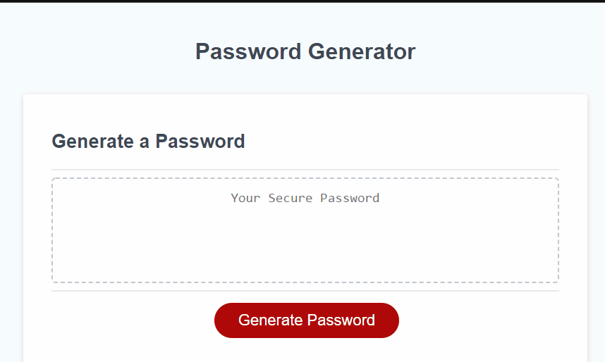

# Password Generator

This project generates a randomized password for the user. The program asks the user if they want to include uppercase, lowercase, number and/or special characters in their password.
then it asks how long the user wants the password to be (between 8-12) and then randomly generates the password for the user with the desired parameters. The user also has the option to cancel the password generation at any time.

# Possible improvements

* Copy button that shows up next to the generate password after it's been made which copies to clipboard on click

## Animated GIF

## Deployed Link

* [See Live Site](https://emdorgan.github.io/password-generator/)

## Built With

* [HTML](https://developer.mozilla.org/en-US/docs/Web/HTML)
* [CSS](https://developer.mozilla.org/en-US/docs/Web/CSS)
* [Javascript](https://developer.mozilla.org/en-US/docs/Web/JavaScript)

## Authors

* **Emily Dorgan** 

- [Link to Github](https://github.com/emdorgan)
- [Link to LinkedIn](https://www.linkedin.com/in/emily-dorgan/)

## Acknowledgments

* FreeCodeCamp lesson on spreading arrays using ...arr notation.